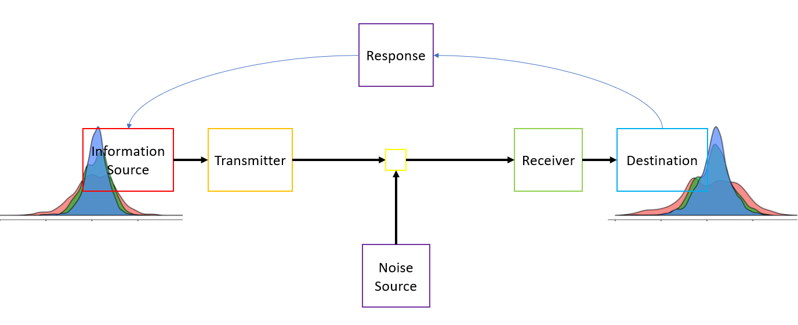

## Anthropomorphism vs. Disconnection Poll

At the end of our Socratic debate, you voted on whether 1) anthropomorphism or 2) disconnection from our evolutionary roots was the more troublesome source of bias in the study of animal communication.

In this part of our "Building the World in Models" lesson, I'd like you to think about how animals decide when they've collected enough information to make sufficiently informed choices regarding their communication with other individuals. In other words, when/how do you think animals decide that they've collected enough data (SMALL WORLD) to accurately represent the realized outcome of a decision (LARGE WORLD). Think back to how the bees selected a new hive site.

In the exercise below, I've written some R code that allows you to generate SMALL WORLD data from the LARGE WORLD true distribution of votes from our Anthropomorphism vs. Disconnection poll. This code essentially works like the marble example from Richard McElreath's book. By clicking the "Generate Random Numbers" button, you are randomly drawing three votes out of the class pool of 23 votes. Each time you click that button, you are pulling three more votes out of the same pool of 23 votes (like placing the marbles back in the bag after each sample).

So, the question is: how many samples would you need to take (how much information do you need to collect) before your SMALL WORLD samples accurately represents the LARGE WORLD distribution of votes? 

Can you describe the trade off between the time/energy it takes to collect more information and making an efficient decision that benefits your fitness?

INSTRUCTIONS: Click the "Generate Random Numbers" button near the bottom of the page. This will generate 3 data points (1s and 0s). Then, plot the votes in the probability distribution figure: for each 0, add a vote for disconnection, and for each 1, add a vote for anthropomorphism. Then, repeat that process, generating 3 new random numbers and adding these new data to the figure.

Each time you add new data, you are updating your prior model to create a posterior model that will more accurately represent the true distribution of the class's total votes. Note how the distribution curve changes as you add more data. 


```{r random numbers 1, echo=FALSE}
# Define the UI for the app
ui <- fluidPage(
  titlePanel("Random Number Generator"),
  sidebarLayout(
    sidebarPanel(
      actionButton("generate_button", "Generate Random Numbers")
    ),
    mainPanel(
      verbatimTextOutput("random_numbers")
    )
  )
)

# Define the server for the app
server <- function(input, output) {
  # Function to generate random numbers
  generateRandomNumbers <- function() {
<<<<<<< HEAD
    random_numbers <- sample(c(0, 1), 3, replace = TRUE, prob = c(11/19, 8/19))
=======
    random_numbers <- sample(c(0, 1), 3, replace = TRUE, prob = c(8/16, 8/16))
>>>>>>> 02dc11796c3be085b73e21b40a21d94268948d25
    return(random_numbers)
  }
  
  # Event handler for the button click
  observeEvent(input$generate_button, {
    numbers <- generateRandomNumbers()
    output$random_numbers <- renderPrint({
      numbers
    })
  })
}
inputPanel(
  numericInput("n_W", label = "Anthropomorphism (1)", 0, min = 0, max = 200),
  
  numericInput("n_L", label = "Disconnection (0)", 0, min = 0, max = 200)
)

renderPlot({
W <- input$n_W
L <- input$n_L
curve(dbeta(x, W+1, L+1), from = 0, to = 1, xlab = "Proportion of votes (D=0/A=1)", ylab = "Probability Density")
})
# Run the app
shinyApp(ui = ui, server = server)
```


